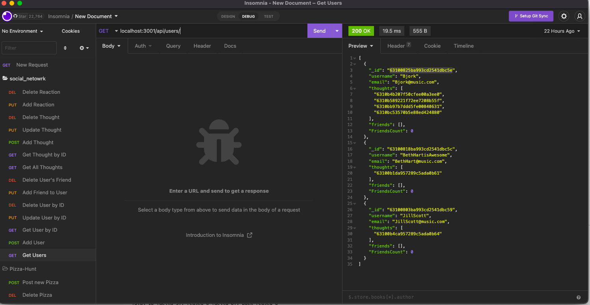
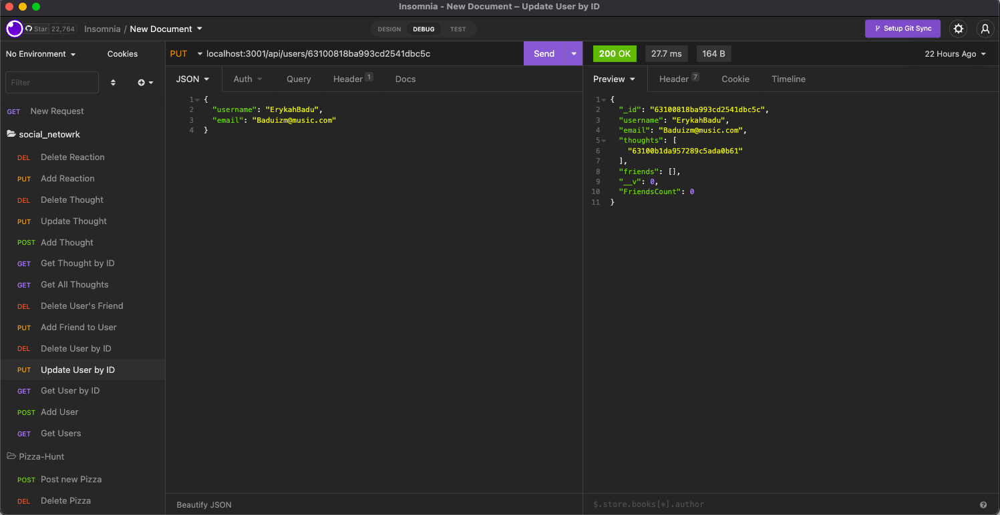

# social_Network

### This project is a build for the back end for a social network startup. 

### this project will include a MongoDB Database with Mongoose ODM and will also use Express.js for routing. Please see walkthrough video for insomnia route demo.
### Future development - I would like to be able to tie this to a front end app and have the full package working and deployed.

### badges

## Table of Contents

- [installation](#installation)
- [contribution guidelines](#contribution)
- [Test Instructions](#testing)
- [License](#license)
- [Questions](#questions)

### Installation
Please clone the github repo here : https://github.com/Vinyldude8896/social_Network
make sure your Mongo service is running and you have ran npmi i to install dependancies
Then you can run the server using npm start at the command line
Then you can test the routes using Insomnia.

### Contribution Guidelines
N/A as of yet
### Testing
To test this application, make sure you have cloned the repo and ran npm I at the command line to install dependancies.
Then use Insomnia or an equivalent middleware application to test the routes for each method:
for insantance:
localhost:3001/api/users/ - will get all users
localhost:3001/api/users/:id - will get a user by ID
### Questions
    email address : kevinnivek@me.com
    - additional instructions 
    I can be contacted by phone as well, but prefer email contact first.

### Images of example readme.md

